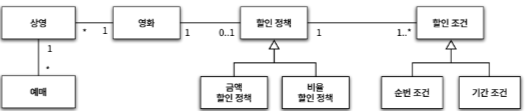

### 협력, 객체, 클래스

**클래스(Class)**에 대한 고민과 결정 뒤 클래스에 어떤 속성과 메서드가 필요한지 고민하는 것은 객체지향의 본질과는 거리가 멀다.
객체지향 패러다임은 **클래스**가 아닌 **객체**에 초점을 맞출 때에만 얻을 수 있다.

어떤 클래스가 필요한지를 고민하기 전에 **어떤 객체들이 필요한지 고민**하라
- 클래스는 공통적인 상태와 행동을 공유하는 객체들을 추상화 한 것
- **클래스 윤곽을 잡기 위해서는 어떤 객체들이 어떤 상태와 행동을 가지는지 결정해야 함**
- 객체를 중심에 두는 접근 방법은 설계를 단순하고 깔끔하게 만들 수 있음

객체를 독립적인 존재가 아니라 기능 구현을 위해 협력하는 공동체의 일원으로 봐야 한다.
- 객체는 다른 객체에게 **도움**을 주거나 **의존**하면서 살아가는 **협력적인 존재**이다.
- 객체를 협력하는 공동체로 바라보는 것은 설계를 유연하고 확장 가능하게 만든다.
- 객체들의 모양과 윤곽이 잡히면 **공통된 특정과 상태를 가진 객체들을 타입으로 분류하고 이 타입을 기반으로 클래스를 구현**하자
- **훌륭한 협력이 훌륭한 객체를 낳고 훌륭한 객체가 훌륭한 클래스를 낳는다.**

#### 도메인의 구조를 따르는 프로그램 구조

**도메인(Domain)** : 문제를 해결하기 위해 사용자가 프로그램을 사용하는 분야
-> 영화 예매 시스템 - 영화를 좀 더 쉽고 빠르게 예매하려는 사용자의 문제를 해결하기 위함

요구사항과 프로그램을 객체라는 동일한 관점에서 바라볼 수 있기 때문에 도메인을 구성하는 개념들이 프로그램의 객체와 클래스로 매끄럽게 연결될 수 있다.



<도메인 관계도 예시 이미지>


<클래스 다이어그램 예시 이미지>

도메인 개념을 구현하기 위해 클래스를 사용한다.
- 일반적으로 클래스의 이름은 대응되는 **도메인 개념**의 이름과 **동일**하거나 적어도 **유사**하게 지어야 한다.
- 클래스 사이의 관계도 최대한 도메인 개념 사이에 맺어진 관계와 유사하게 만들어서 **프로그램의 구조를 이해하고 예상하기 쉽게 만들어야 한다.**

#### 클래스 구현

클래스 구현에 가장 중요한 것은 클래스의 경계를 구분짓는 것
- 클래스는 내부와 외부로 구분된다.
- 클래스 설계의 핵심은 어떤 부분을 외부에 공개하고 어떤 부분을 감출지를 결정하는 것이다.
- 내·외부 경계의 명확성은 객체의 자율성은 보장한다.
- 또한 프로그래머에게도 **구현의 자유를 제공**한다.

##### 자율적인 객체

객체를 자율적인 존재로 만들기 위해서는 외부 간섭을 최소화해야 한다.
- 외부에서는 객체가 어떤 상태에 놓여 있는지, 어떤 생각을 하는지 알아서는 안된다.
- 객체에게 원하는 것을 **요청**하고 객체가 스스로 최선의 방법을 결정할 수 있을 것이라는 점을 믿어야 한다.

캡슐화와 접근 제어는 객체를 **퍼블릭 인터페이스(Public Interface)**와 **구현(Implementation)**으로 나눈다.
- **퍼블릭 인터페이스(Public Interface)** : 객체 외부에서 접근 가능한 부분
- **구현(Implementation)** : 객체 내부에서만 접근 가능한 부분

> 인터페이스와 구현의 분리 원칙은 객체지향 프로그래밍을 위한 핵심 원칙이다.

일반적으로 객체의 상태는 숨기고 행동만 외부에 공개해야 한다.
- 클래스의 속성은 **private**로 선언
- 외부에 제공해야 하는 일부 메서드만 **public**으로 선언
- 서브클래스나 내부에서만 접근해야 하는 메서드는 **private**으로 선언

##### 프로그래머의 자유

**클래스 작성자(Class Creator)** : 새로운 데이터 타입을 프로그램에 추가하는 프로그래머
**클라이언트 프로그래머(Client Programmer)** : 클래스 작성자가 추가한 데이터 타입을 사용하는 프로그래머
- 목표한 클래스들을 엮어서 애플리케이션을 빠르고 안정적으로 구축하는 것이 목표
- 클라이언트 프로그래머에게 필요한 부분만 공개, 나머지는 꽁꽁 숨김
- 접근 방지로 인해 클라이언트 프로그래머에 대한 영향을 걱정하지 않고도 내부 구현을 마음대로 변경 가능 **(구현 은닉 효과)**


클라이언트 프로그래머는 내부 구현은 무시한 채 인터페이스만 알고 있어도 클래스를 사용할 수 있다.

클래스 작성자는 인터페이스를 바꾸지 않는 한 외부에 미치는 영향을 걱정하지 않고도 내부 구현을 마음대로 변경할 수 있다.

> **public 영역을 변경하지 않는다면 코드를 자유롭게 수정할 수 있게 된다.**

#### 협력하는 객체들의 공동체


영화를 예매하기 위해 `Screening`, `Movie`, `Reservation` 인스턴스들은 서로의 메서드를 호출하며 상호작용 한다.
이처럼 시스템의 어떤 기능을 구현하기 위해 객체들 사이에 이뤄지는 상호작용을 **협력(Collaboration)**이라고 부른다.

##### 협력

객체는 다른 객체의 인터페이스에 공개된 행동을 수행하도록 **요청(request)** 할 수 있다.
요청 받은 객체는 자율적인 방법에 따라 요청을 처리한 후 **응답(response)** 한다.

객체가 다른 객체와 상호작용할 수 있는 유일한 방법은 **메시지를 전송하는 것** 뿐이다.
다른 객체에게 요청이 도착할 때 해당 객체가 **메시지를 수신**했다고 한다.

메시지를 수신한 객체는 자율적으로 메시지를 처리할 방법을 결정한다.
이처럼 **수신된 메시지를 처리하기 위한 자신만의 방법**을 **메서드(Method)** 라고 부른다.

```java
public class Screening {  
  
    //... 
  
    public Reservation reserve(Customer customer, int audienceCount) {  
        return new Reservation(customer, this, calculateFee(audienceCount), audienceCount);  
    }  
  
    private Money calculateFee(int audienceCount) {  
        return movie.calculateMovieFee(this).times(audienceCount);  
    }  
}
```

위 코드는 `Screening`이 `Movie`의 `calculateMovieFee()` **메서드를 호출한다** 라고 말하지만
`Screening`이 `Movie`에게 `calculateMovieFee()` **메시지를 전송한다** 라고 말하는 것이 더 적절한 표현이다.
- `Screening`은 `Movie`안에 `calculateMovieFee()` 메서드가 존재하는지 조차 알지 못한다.
- 단지 `Movie`가 `calculateMovieFee()` 메시지에 응답할 수 있다고 믿고 메시지를 전송한다.
- `Movie`는 자율적으로 메시지를 처리할 방법을 결정한다.
#### 상속과 다형성


```java
public class Movie {  
  
    private String title; // 제목  
    private Duration runningTime; // 상영 시간  
    private Money fee; // 기본 요금  
    private DiscountPolicy discountPolicy; // 할인 정책  
  
    public Movie(String title, Duration runningTime, Money fee, DiscountPolicy discountPolicy) {  
        this.title = title;  
        this.runningTime = runningTime;  
        this.fee = fee;  
        this.discountPolicy = discountPolicy;  
    }  
    //... 
}
```


```java
Movie avatar = new Movie("아바타", 
						 Duration.ofMinutes(120), 
						 Money.wons(10000), 
						 new AmountDiscountPolicy(Money.wons(800)));
```

확장 가능한 객체지향 설계가 가지는 특징 중 하나는 코드의 의존성과 실행 시점의 의존성이 다를 수 있다.
- `Movie` 코드 작성 시점에는 `DiscountPolicy`과 연결되어 있지만, 실행 시점에는 `AmountDiscountPolicy`에 의존하게 됨
- 클래스 사이의 의존성과 객체 사이의 의존성은 동일하지 않을 수 있다.
- **코드의 의존성과 실행 시점의 의존성이 다를 수록 코드는 더 유연해지고 확장 가능해 진다.**
- 코드의 이해는 더 어려워질 수 있다. (`Movie` 클래스 상에서는 어떤 객체에 의존하는지 파악 X)
- 설계가 유연해질수록 코드를 이해하고 디버깅하기는 어려워진다는 말과 같다.

> **유연성과 가독성 사이에서 고민하며 객체지향 설계를 해야한다.**

##### 차이에 의한 프로그래밍

**상속**은 기존 클래스와 흡사한 클래스의 코드를 전혀 수정하지 않고 재사용할 수 있도록 하는 방법이다.
- 클래스 사이의 관계 설정만으로도 기존 클래스가 가진 모든 속성과 행동을 새로운 클래스에 포함시킬 수 있다.
- 부모 클래스의 구현을 공유하면서도 행동이 다른 자식 클래스를 쉽게 추가할 수도 있다.

> 부모 클래스와 다른 부분만을 추가해서 새로운 클래스를 쉽고 빠르게 만드는 방법을
> **차이에 의한 프로그래밍**이라고 부른다.

##### 다형성

**다형성**은 객체지향 프로그램의 컴파일 시간 의존성과 실행 시간 의존성이 다를 수 있다는 사실을 기반으로 한다.
- `Movie`는 컴파일 시점에 `DiscountPolicy`에 의존하지만 실행 시점에는 `DiscountPolicy`의 자식 클래스에 의존한다.
- `Movie`는 `DiscountPolicy`에 `calculateDiscountPolicy` 메세지를 전송하지만 실제로 실행되는 메서드는 실행 시점에 의존 관계인 클래스가 가진 메서드가 실행된다.
- 이렇게 실행 시점에 실행될 메서드를 결정하는 것을 **동적 바인딩(dynamic binding)**이라고 부른다.

다형성은 동일한 메시지를 수신했을 때 객체의 타입에 따라 다르게 응답할 수 있는 능력이다.
- 다형적인 협력에 참여하는 객체들은 모두 같은 메시지를 이해할 수 있어야 한다.
- 다시 말해, **인터페이스**가 동일해야 한다는 것이다.
- `AmountDiscountPolicy`와 `PercentDiscountPolicy`는 `DiscountPolicy`로 부터 동일한 인터페이스를 물려받았기 때문에 다형적인 협력이 가능하다.
- **상속**을 통해 동일한 인터페이스를 공유하는 클래스들을 하나의 타입 계층으로 묶어 이러한 협력 방식을 구현했다.

프로그래밍 요소 중 인터페이스의 경우 구현은 공유하지 않고 순수하게 인터페이스만 공유하는 경우에 사용한다.
**구현에 대한 고려 없이 다형적인 협력에 참여하는 클래스들이 공유 가능한 외부 인터페이스를 정의하는 것이다.**

#### 추상화와 유연성


추상화는 구현의 **일부**(추상 클래스) 또는 **전체**(자바 인터페이스)를 **자식 클래스가 결정할 수 있도록 위임**한다.
- 추상화의 계층만 따로 떼어 놓고 보면 요구사항의 정책을 높은 수준에서 서술할 수 있다.
- 추상화를 이용하면 설계가 좀 더 유연해진다.

위 다이어 그램을 한 문장으로 정의하면 영화 예매 요금은 **"최대 하나의 할인 정책과 다수의 할인 조건을 이용해 계산할 수 있다."** 로 표현할 수 있다.
- 위 문장은 **"금액 할인 정책과 두 개의 순서 조건, 한 개의 기간 조건을 이용해서 계산할 수 있다"** 라는 문장을 포괄할 수 있다는 사실이 중요하다.
- 이것은 **좀 더 추상적인 개념들을 사용해 문장을 작성했기 때문이다.**

추상화는 세부 내용을 무시한 채 상위 정책을 쉽고 간단하게 표현할 수 있다.
- 세부 사항에 억눌리지 않고 상위 개념만으로 도메인의 중요한 개념을 설명할 수 있다.
- 필요에 따라 표현 수준의 조정을 가능하게 해준다.

추상화를 이용해 상위 정책을 기술한다는 것은 기본적인 애플리케이션의 협력 흐름을 기술한다는 것을 의미한다.
- 할인 정책이나 할인 조건의 자식 클래스는 추상화로 정의한 상위 클래스의 흐름을 그대로 따른다.
- 디자인 패턴이나 프레임워크 모두 추상화를 이용해 상위 정책을 정의하는 객체지향 메커니즘을 활용한다.

추상화가 유연한 설계를 가능하게 하는 이유는 **설계가 구체적인 상황에 결합되는 것을 방지**하기 때문이다.
- `Movie`는 특정한 할인 정책에 묶이지 않는다.
- 할인 정책을 구현한 클래스가 `DiscountPolicy`를 상속받고 있다면 어떤 클래스와도 협력이 가능하다.

