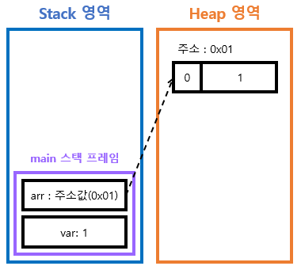
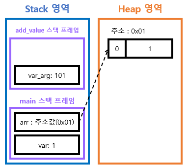
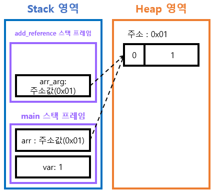

# Call by Value 와 Call by Reference란?
> `Call by Value`는 함수의 인자를 전달할 때 `값`을 전달하는 방식
> <br> `Call by Reference`는 `주소`를 전달하는 방식
 
**자바는 `Call by Value`방식을 사용하며, `Call by Reference`는 존재하지 않는다.**

```
the Java authors choose to only include one simple idea - pass-by-value, 
with no default values or optional parameter (overloading often provides a satisfactory alternative), 
no variable length parameter lists (added finally in Java 5), 
no named parameters, no pass-by-reference, no const (a general Java issue) parameters, etc. 

-The Java Programming Language, 2nd ed. by Ken Arnold and James Gosling, section 2.6.1, page 40, 3rd paragraph.
```

## Call by Value
> `값만` 전달하는 방식
>
> 전달받은 값을 복사하여 처리한다. 전달받은 값을 변경하여도 원본은 변경되지 않음

```java
public class MyClass {
    public static void main(String args[]) {
      int num1 = 10;
      int num2 = 20;

      System.out.println("Before Call Method : num1 = " + num1 + ", num2 = " + num2);
      
      ex_method(num1, num2);
      
      System.out.println("After Call Method : num1 = " + num1 + ", num2 = " + num2);
    }
    
    public static void ex_method(int num1, int num2) {
        num1 = 30;
        num2 = 40;
        
        System.out.println("Inside Method : num1 = " + num1 + ", num2 = " + num2);
    }
	// Before Call Method : num1 = 10, num2 = 20
	// Inside Method : num1 = 30, num2 = 40
	// After Call Method : num1 = 10, num2 = 20
}
```

## Call by Reference
> 참조에 의한 호출
>
> 전달받은 값을 직접 참조한다. 전달받은 값을 변경하면 원본도 같이 변경된다.

### Java
```java
public class MyClass {
    int value;

    MyClass(int value) {
        this.value = value;
    }

    public static void swap(MyClass x, MyClass y) {
        int temp = x.value;
        x.value = y.value;
        y.value = temp;
        
    }
    
    public static void main(String[] args) {
    
        MyClass num1 = new MyClass(10);
        MyClass num2 = new MyClass(20);
        
        
        System.out.println("Before Call Method : num1 = " + num1.value + ", num2 = " + num2.value);
        
        swap(num1, num2);
        
        System.out.println("After Call Method : num1 = " + num1.value + ", num2 = " + num2.value);
    
    }
    // Before Call Method : num1 = 10, num2 = 20
    // After Call Method : num1 = 20, num2 = 10
}
```

## Java에서 Call by Reference는 없다?
자바의 데이터형에는 두가지가 있다.
- **기본형(primitive type)** : Boolean Type(boolean), Numeric Type(short, int, long, float, double, char)
- **참조형(reference type)** : Class Type, Interface Type, Array Type, Enum Type, 기본형을 제외한 모든 것들

```java
public class main
{
    public static void main(String[] args)
    {
        int var = 1;
        int[] arr = { 1 };

        // call by value
        add_value(var);
        System.out.println("primitive type : " + var); // 1 : 값 변화가 없음

        // call by reference
        add_reference(arr);
        System.out.println("reference type : " + arr[0]); // 101 : 값이 변화함
    }

    static void add_value(int var_arg) {
        var_arg += 100;
    }

    static void add_reference(int[] arr_arg) {
        arr_arg[0] += 100;
    }
}
```

기본형 (int, double, boolean 등)은 stack의 변수 안에 value 저장
<br> 참조형 (Integer, Obejct, Array, Map 등) 은 stakc의 변수 값에는 객체의 주소 값, 객체는 별도의 Heap영역에 저장



- primitive type : 원시값이 저장된다.
- reference type : 실제 데이터는 heap 메모리에 저장되고, stack에는 주소값이 저장된다.



- add_value 내 var_arge가 바뀐 것
- var가 바뀐것 아님



- arr과 arr_arg가 같은 주소값
- 두 변수가 하나의 데이터를 동시에 참조

<br>

이를 보면 `call by reference`가 아닌가 생각이 들 수 있다.

그러나, Java는 C와 달리 포인터를 철저하게 숨겨 개발자가 직접 메모리 주소에 접근하지 못하게 했기 때문에 call by reference라는 개념이 존재하지 않는다.

즉, `call by value`로 동작하면서 단지 **원시값**이 복사되느냐 **주소값**이 복사되느냐의 차이이다.

위의 예시를 보면 두 변수 안에는 같은 주소를 가지고 있을 뿐 두 변수는 서로 별도로 분리되어 존재한다.
<br> `add_reference()` 호출 시 `arr`의 주소값을 담아 새로운 변수를 선언한다. 이는 단순히 주소값의 복사이다.
<br> 각 변수는 서로 다른 scope에 존재한다.

call by reference이려면 **두 변수가 완전히 같아야 한다.**

> 이 때문에 똑같은 value지만 call by value / call by address 로 구분하기도 한다.

<br>
<br>

* * *
### Reference

[명품자바에센셜](http://www.yes24.com/Product/Goods/63041975)

[자바는 Call by reference 개념이 없다❓](https://inpa.tistory.com/entry/JAVA-%E2%98%95-%EC%9E%90%EB%B0%94%EB%8A%94-Call-by-reference-%EA%B0%9C%EB%85%90%EC%9D%B4-%EC%97%86%EB%8B%A4-%E2%9D%93)

[[Java] Call by value와 Call by reference](https://re-build.tistory.com/3)

[[Java] Java는 Call by reference가 없다](https://deveric.tistory.com/92)

[[Java] Call by Value, Call by Reference](https://velog.io/@ahnick/Java-Call-by-Value-Call-by-Reference)

[[JAVA] Call by Value와 Call by reference란?](https://devlog-wjdrbs96.tistory.com/44)

[[개발공통] Call by value와 Call by reference (Java, Python, C/C++)](https://hoons-dev.tistory.com/76)


[Call By Reference와 Call By Value](https://okky.kr/questions/303162)
