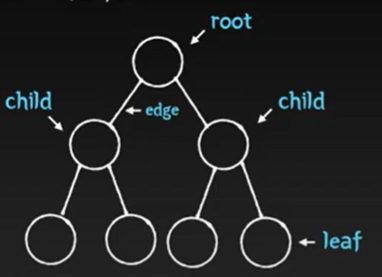

# tree 자료구조
!

계층 구조를 표현하는 데 사용되는 비선형 자료구조
- 트리는 노드(node)들의 집합으로 구성된다.
- 노드 기반 자료구조는 서로 인접하지 않은 메모리 셀 묶음으로 이뤄진다.
- 노드의 앞-뒤 관계가 1:N or N:N
- 트리는 순환이 존재할 수 없다. 어떤 경로를 따라 이동하더라도 하나의 노드를 두번 이상 방문하지 않는다.

## 구성 요소
- 노드(Node): 트리를 구성하고 있는 각각의 요소
- 루트 노드(Root Node): 트리 구조에서 최상위에 있는 노드
- 단말 노드(Terminal Node, Leaf Node): 하위에 다른 노드가 연결되어 있지 않은 노드
- 내부 노드, 비단말 노드(Internal Node): 단말 노드를 제외한 모든 노드로 루트 노드를 포함
- 부모 노드(Parent Node): 부모 자식 관계에서 상위 계층에 있는 노드로, 상위 계층에 있을수록 노드의 깊이와 레벨이 낮음
- 자식 노드(Child Node): 부모 자식 관계에서 하위 계층에 있는 노드
- 형제 노드: 부모가 동일한 노드
- 조상 노드: 한 노드의 부모노드부터 루트노드까지 가는 경로에 존재하는 모든 노드를 해당 노드의 조상 노드라 함
- 후손 노드: 한 노드를 루트로 하는 서브트리에 있는 모든 노드를 해당 노드의 후손 노드라 함
- 간선(Edge): 트리를 구성하기 위해 노드와 노드를 연결하는 선
- 크기(size) : 루트를 포함한 모든 노드의 수
- 깊이 (Depth): 루트 노드에서 해당 노드까지 도달하는 데 사용하는 간선의 개수로, 루트 노드의 깊이는 0
- 높이(Height): 깊이의 최댓값, 리프 노드를 기준으로 루트까지의 높이
- 레벨(Level): 같은 깊이를 가지고 있는 노드를 묶어서 레벨로 표현. (루트의 레벨은 1)
- 서브트리(Sub Tree) : 하나의 트리 안에 작은 트리 구조를 이루고 있는 형태의 트리
- 차수(degree) : 각 노드의(자식 방향) 간선 개수
> 기본적으로 트리의 크기가 N이라면, 전체 간선의 개수는 N-1개이다.

## 이진트리(Binary Tree)

각 노드가 최대 2개의 자식 노드를 가지는 트리(트리의 차수가 최대 2인 트리)
- 루트 노드를 중심으로 2개의 서브 트리로 나뉨
- 자식이 최대 2개이기 때문에 왼쪽 자식과 오른쪽 자식으로 구분

### 이진 탐색 트리(Binary Search Tree) - BST
이진 탐색이 동작할 수 있도록 고안된 트리 자료구조

#### 조건

- 왼쪽 자식 노드 < 부모 노드 < 오른쪽 자식 노드
- 왼쪽, 오른쪽 서브 트리도 모두 이진 탐색 트리
- 왼쪽 서브 트리의 키들은 루트 키보다 작음
- 오른쪽 서브 트리의 키들은 루트 키보다 큼
- 중복 키를 허용하지 않음

#### 특징
- BST는 중위 순회(In-order Traversal)을 수행하여 모든 키를 정렬된 순서로 가져올 수 있음
- BST 검색에 대한 시간 복잡도는 균형 상태인 경우 O(logN), 불균형 상태인 경우 최대 O(N) 소요

### 주요 연산
#### 검색(Search)
이진 탐색 트리에서 특정 노드를 찾는 연산이다.
1. 루트에서 시작
2. 검색 값을 루트와 비교. 루트보다 작으면 왼쪽 트리에 대해 재귀하고, 크다면 오른쪽으로 재귀
3. 일치하는 값을 찾을 때까지 절차를 반복

#### 삽입(Insert)
새로운 노드를 트리에 추가   
새 키는 항상 리프 노드에 삽입된다.
1. 루트에서 시작
2. 검색 값을 루트와 비교. 루트보다 작으면 왼쪽 트리에 대해 재귀하고, 크다면 오른쪽으로 재귀
3. 리프 노드에 도달한 후 노드보다 크다면 오른쪽에 작다면 왼쪽에 삽입

#### 삭제(Delete)
트리에서 특정 노드를 제거   

##### 삭제할 노드가 리프 노드인 경우
해당 노드만 삭제하면 됨

##### 삭제할 노드가 리프 노드가 아닌 경우
노드를 삭제하고 끊어진 자식 노드를 삭제된 노드의 부모 노드에 연결

##### 삭제할 노드에 자식이 둘 있는 경우
삭제하려는 노드의 위치에 다른 노드를 가져와 공백을 매꾸어야 함  
다른 노드들의 변경 없이 이진 탐색 트리의 조건을 만족 시켜야 함

- 삭제하려는 노드와 가장 가까운 노드를 탐색(successor 노드 탐색)
  - 삭제하려는 노드의 왼쪽 서브 트리에서 가장 큰 값(가장 오른쪽에 있는 노드)
  - 삭제하려는 노드의 오른쪽 서브 트리에서 가장 작은 값(가장 왼쪽에 있는 노드)

1. 삭제할 노드를 찾는다
2. 삭제할 노드의 successor 노드를 찾는다
3. 삭제할 노드와 successor 노드의 값을 바꾼다
4. 노드를 삭제한다

#### 순회(Tree Traversal)
트리 자료구조에 포함된 노드를 특정한 방법으로 한번씩 방문하는 방법
- 전위 순회(pre-order traverse) : 부모 노드를 먼저 방문한 후, 왼쪽 자식과 오른쪽 자식 순으로 방문
- 중위 순회(in-order traverse) : 왼쪽 자식을 먼저 방문하고, 부모 노드, 그 다음 오른쪽 자식을 방문
- 후위 순회(post-order traverse) : 왼쪽 자식과 오른쪽 자식을 먼저 방문한 후, 부모 노드를 방문

1. 전위 순회 : A-B-D-E-C-F-G
2. 중위 순회 : D-B-E-A-F-C-G
3. 후위 순회 : D-E-B-F-G-C-A
