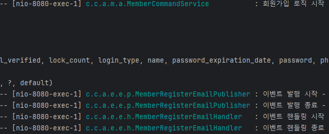
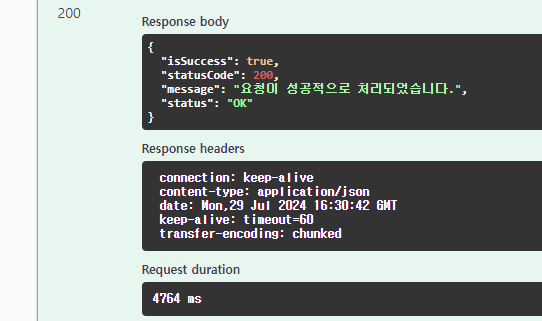
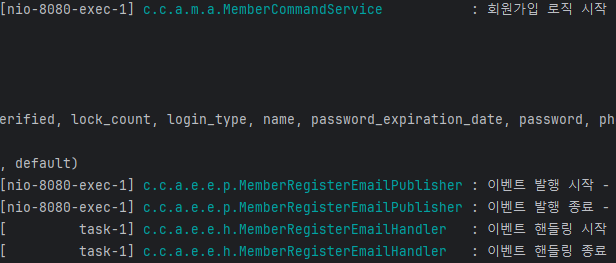
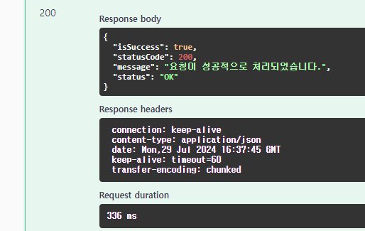

## 회원가입 성공시 축하 email 발송 기능 구현 - spring event 활용

### 상황

이번에 회원가입 기능을 구현한 후 `Member` 데이터가 성공적으로 
**insert** 되었다면 회원가입을 축하하는 email을 발송하는 기능을 구현하기로 했다.

하지만 **email 발송 로직**과 **회원가입 로직**을 **하나의 트랜잭션**에서 함께 관리하게 될 경우 문제점이 발생한다.
```java
@Slf4j
@Service
@RequiredArgsConstructor
public class MemberCommandService {

    private final MemberRepository memberRepository;
    private final PasswordEncryptor passwordEncoder;
    private final EmailService emailService;

    @Transactional
    public void signUp(SignUpServiceRequest request) {

        validateDuplicateEmail(request.getEmail());
        validateDuplicatePhoneNumber(request.getPhoneNumber());

        Member member = request.toEntity()
                .encode(request.getPassword(), passwordEncoder);

        memberRepository.save(member);

        emailService.sendEmail(member); // 이메일 발송 로직 
    }
// ...
}
```
1. 회원 가입 실패 -> 이메일 발송 실패 (정상적 요구사항)
2. **회원 데이터 저장 성공 -> 이메일 발송 실패 -> 회원 가입 실패 (비정상적 요구사항)** 

회원 가입에 성공하는 경우에만 이메일 발송이 이루어져야 하므로 1번 case의 경우에는 정상적인 요구사항이라고 말할 수 있다.

하지만 2번 요구사항의 경우 회원가입 로직에는 성공했지만 이메일 발송 실패로 인해 **회원가입 자체가 rollback** 되어버려 회원가입이 이루어지지 않게 된다.

이메일 발송 작업은 회원가입 성공 여부에 따라 실행되는게 맞지만 회원가입은 이메일 발송 성공 성공 여부와는 관계가 없어야 한다.
즉, **이메일 발송에 실패해도 회원 가입은 성공해야 한다.**

### 객체지향 측면에서의 문제점 파악

#### 1. 강한 결합

회원가입 로직(핵심 기능)과 이메일 발송 로직(부가 기능)이 서로 강하게 결합되어 있다. 

**강한 결합은 코드의 유연성을 떨어뜨리고, 변경에 취약한 구조를 만든다.**

#### 2. 단일 책임 원칙(SRP) 위반

회원가입 로직이 이메일 발송 책임도 가지게 되면, 클래스가 두 가지 책임을 동시에 갖게 된다. **이또한 코드의 복잡도를 높이고 유지보수를 어렵게 만든다.**

#### 3. 성능 문제

이메일 발송을 위해 **mailSender api**를 사용했다. mailSender api를 
사용해 이메일 발송 시 대략 수 초가 걸리게 되는데 회원 가입 로직과 이메일 발송 로직이 묶인다는 것은 
회원 가입 요청 ~ 응답까지 수 초가 걸린다는 의미이다.

회원가입 완료 처리는 이메일 발송을 기다릴 필요가 없는데 **이메일 발송으로 인해 회원가입이 지연되는 것이다.**

#### 4. 확장성

회원 가입 로직에 이메일 발송 로직 외에 다른 로직이 추가된다면 회원가입 로직에 수정이 발생하게 되므로 시스템 변경과 확장이 더욱 어려워진다.

위에서 언급한 문제들을 해결하고 요구사항을 충족시키기 위해 **Spring**에서 제공하는 **event** 기능을 사용하기로 했다.

### 스프링 이벤트(Spring Event)

Spring Event는 이미 스프링 프레임워크 
내부에서 데이터나 신호를 전달하기 위해 사용되고 있는 프레임워크를 이루는 강력한 메커니즘 중 하나이다.

Event를 사용하면 각각의 코드별 관심사를 분리해 결합도를 낮출 수 있고, 확장성과 유지보수성을 높일 수 있다.

#### Event 주요 요소

#### 1. Event

Event는 **특정 사건이 발생했음을 나타내는 객체**이다. 이벤트를 처리하는데 필요한 정보를 담고 있다. Spring 4.2 이전에는 `ApplicationEvent` 객체를
상속해야 했지만 4.2 이후에는 일반 POJO도 사용가능 하다.

```java
@Getter
public class DomainEvent {
    private final LocalDateTime publishAt;

    public DomainEvent() {
        this.publishAt = LocalDateTime.now();
    }
}

@Getter
@RequiredArgsConstructor
public class MemberRegisterEvent extends DomainEvent {
    private final Member member;
}
```
- 도메인 & 기능 별 이벤트 처리를 위한 이벤트 클래스를 구현 후 이벤트 기능의 확장을 고려해 이벤트 발생 시점을 나타내는 데이터를 담는 `DomainEvent` 클래스를 상속하는 방식으로 사용했다.

#### 2. Event Publisher

Event Publisher는 특정 이벤트를 발생시키는 역할을 한다. 
스프링에서는 ApplicationEventPublisher를 사용하여 이벤트를 게시한다.

```java
@Slf4j
@Component
public class MemberRegisterEmailPublisher implements ApplicationEventPublisherAware {

    private static ApplicationEventPublisher applicationEventPublisher;


    public static void publishEvent(DomainEvent event) {
        log.info("이벤트 발행 시작 - MemberRegisterEmailPublisher");

        applicationEventPublisher.publishEvent(event);
        log.info("이벤트 발행 종료 - MemberRegisterEmailPublisher");
    }

    @Override
    public void setApplicationEventPublisher(ApplicationEventPublisher applicationEventPublisher) {
        MemberRegisterEmailPublisher.applicationEventPublisher = applicationEventPublisher;
    }
}
```
- `ApplicationEventPublisher`는 `ApplicationEventPublisherAware`를 통해 컨텍스트에 세팅된다.
이를 통해 `ApplicationContext` 생명주기에 따라 `ApplicationEventPublisherAware`가 실행되어 `ApplicationEventPublisher`를 주입받을 수 있게 된다.
- 해당 클래스에서 회원가입 메일에 대한 이벤트 발행이 이루어진다.

#### 3. Event Listener

Event Listener는 특정 이벤트의 발생을 감지하고, 그에 대한 처리 로직을 담당한다. Spring 4.2 이전에는
ApplicationListener 인터페이스를 구현했지만 그 이후에는 `@EventLister` 어노테이션을 통해 컴포넌트를 리스너로 등록할 수 있다.

```java
@Slf4j
@Component
@RequiredArgsConstructor
public class MemberRegisterEmailHandler {

    private final EmailService emailService;

    @Async
    @TransactionalEventListener(
            classes = MemberRegisterEvent.class,
            phase = TransactionPhase.AFTER_COMMIT
    )
    public void handleEvent(MemberRegisterEvent memberRegisterEvent) {
        log.info("이벤트 핸들링 시작 - {}", this.getClass().getSimpleName());

        Member member = memberRegisterEvent.getMember();
        emailService.sendEmail(member.getEmail(), member.getName());

        log.info("이벤트 핸들링 종료 - {}", this.getClass().getSimpleName());
    }
}
```
- 요소별 명칭은 **EventListener**를 사용하고 있지만 발행된 이벤트를 실제로 처리하는 클래스라는 의미에 맞게 Lister가 아닌 `Handler`라는 명칭을 사용했다.

### @TransactionalEventListener

스프링 4.2 이후 부터 `@EventListener`의 확장 기능인 `@TransactionalEventListener` 어노테이션을 제공하고 있다.

이 어노테이션은 이벤트 처리가 필요한 로직에서 트랜잭션을 적용해야 하는 경우 사용한다. `@TransactionalEventListener`
를 사용하면 트랜잭션의 상태에 따라 이벤트 처리를 따로 제어할 수 있다.

#### 기본 옵션

phase 옵션을 통해 트랜잭션 상태에 따른 이벤트 처리를 설정할 수 있다.
- TransactionPhase.AFTER_COMMIT(default) : 트랜잭션이 commit 되었을 때 이벤트를 실행
- TransactionPhase.ROLLBACK : 트랜잭션이 rollback 되었을 때 이벤트를 실행
- TransactionPhase.AFTER_COMPLETION : 트랜잭션이 완료(commit 또는 rollback) 되었을 때 이벤트 실행
- TransactionPhase.BEFORE_COMMIT : 트랜잭션이 commit 되기 전에 이벤트를 실행

위 코드에서는 **TransactionPhase.AFTER_COMMIT** 옵션을 사용해 회원가입 트랜잭션이 
`commit`된 시점에만 관련 이벤트가 실행되도록 하여 **메인 기능에 문제가 생긴다면 이벤트 발생을 통제할 수 있도록 제어**했다.

#### 유의점


NOTE: The transaction will have been committed already, 
but the **transactional resources might still be active and accessible.** 
As a consequence, any **data access code triggered at this point will still "participate" in the original transaction**, 
 to perform some cleanup (**with no commit following anymore!**), unless it explicitly declares that it needs to run in a separate transaction. 
 Hence: Use PROPAGATION_REQUIRES_NEW for any transactional operation that is called from here.

**AFTER_COMMIT**옵션의 경우 트랜잭션 `commit`이후에 동작하지만 
트랜잭션 리소스가 여전히 활성 상태일 수 있어서 추가적인 데이터 접근 작업이 이루어질 경우 **추가 `commit`을 허용하지 않는다고 한다.**

만약 리스너에서 추가적인 데이터 작업이 필요한 경우 
`@Transactional(propagation = Propagation.REQUIRES_NEW)`를 추가로 설정해 이전 트랜잭션에서 벗어나 새로운 트랜잭션에서 작업하면 된다.

### 비동기 이벤트

이벤트의 사용으로 코드간 결합도를 낮추고 관심사를 분리하는 등의 이점을 챙길 수 있다.

코드 상에 엮여있는 의존성을 분리할 수 있지만 이벤트는 기본적으로 동기 방식으로 동작하기 때문에 코드 간 결합도를 낮추게 된다고 해도
결국 회원 가입 로직이 종료(완료)되려면 이메일 발송을 마쳐야 한다.


이벤트는 기본적으로 기존 로직을 처리하던 스레드에서 **동기 방식**으로 동작한다.



요청에 대한 응답이 무사히 이루어졌지만 메일 발송 이벤트가 회원 가입과 같은 스레드에서 처리되어
회원 가입 성능이 여전히 좋지 않다.

스프링은 `@Async` 어노테이션을 사용해 비동기 이벤트 처리도 지원하고 있다.
이를 활용하면 **이벤트 처리를 기존 로직과 다른 스레드에서 실행**할 수 있다. 즉, 이벤트 발행 까지는 기존 로직에서 이루어지지만
이벤트 리스너에서의 처리는 별개의 스레드에서 동작해 회원가입과 이메일 발송 기능을 완전히 분리할 수 있게 된다.



이벤트 발행 까지는 회원가입과 같은 스레드에서 동작하지만 **이벤트 처리는 다른 스레드에서 동작**하게 된다.



회원가입 과정에서 **이메일 발송 처리 작업을 분리**해 회원가입 응답에 소요되는 시간을 **단축**시킬 수 있었다.

### TODO

Spring Event를 사용해 회원가입 기능과 이벤트 발송 기능을 분리하는데 성공했지만, 이벤트를 사용함에 따른 추가적인 고민거리도 생겼다.

- 하나의 이벤트만 사용하고 있기에 구현 과정에서 발생한 문제는 크게 없었지만, 
여러 이벤트 발생 & 처리가 필요할 시 비동기 이벤트 설정에 따른 side effect 고려 필요(이벤트 실행 순서, 비동기 관련 추상화 등)
- 구현 규모가 확장되고 기능 세분화를 고려 과정에서 이벤트를 사용할 경우 트랜잭션과 관련해 발생할 수 있는 문제 고려
- 이벤트 발생 & 처리 로직이 늘어날수록 공통 코드를 추상화할 방안 고려 필요


